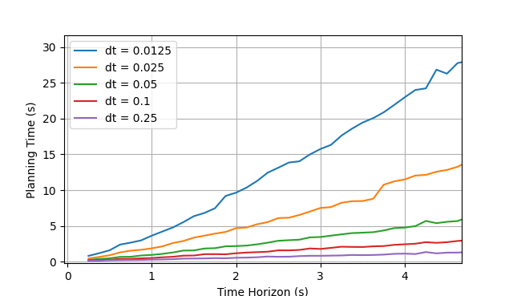
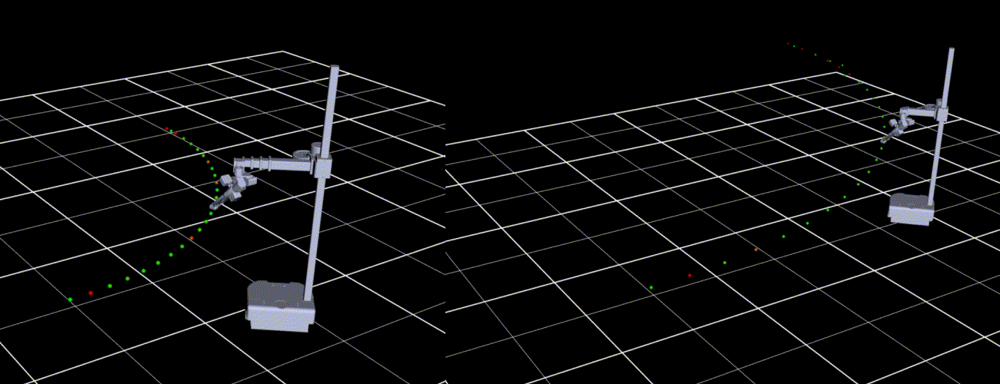

# Development Notice

**WARNING:** This is a development repo that we are using to perform experiments about whole-body motion planning for Stretch. The code in this repo may not be in a usable state. The code in this repo may be unstable, since we are actively conducting development in this branch. Since we have performed limited testing, you may encounter unexpected behaviors. Please contact the author (lamsey@hello-robot.com) if you are interested in using or extending this code.

# Stretch Planner

This repository contains code for planning whole-body trajectories for Stretch RE3. It is based on preliminary work from Michal Ciebielski, found [here](https://github.com/michal-cie/stretch_trajopt), which leverages the [OpTaS](https://arxiv.org/pdf/2301.13512) task optimization library for robots. Information about the original project is located in `old_README.md`.


Figure 1. Optimized whole-body trajectories for a Stretch RE3. Left: end effector tracks position only. Right: end effector tracks a set angle (45deg tilt upwards).

Currently, the planner is virtual - the optimized trajectories cannot yet be run directly on a robot. However, the robot's joint state information may be extracted at each point along the trajectory.

# Installation

This repository uses python 3.8.

```bash
cd stretch_planner
pip install -e .
```

## Dependencies
* casadi
* numpy
* pyoptas
* urchin (for manipulating URDFs)
* matplotlib (only if visualizing trajectories using matplotlib, such as in `stretch_planner/test/sandbox.py`)

# Usage

Try out the example, which optimizes a triangular trajectory: `python3 stretch_planner/test/example.py`. You should see something that looks like this:


Figure 2. Example triangle trajectory with a continuously varying end effector orientation.

This example consists of the following code:

```python3
# instantiate planner
urdf_dir = get_urdf_dir()
planner = wbp.Planner(urdf_dir, mode=wbp.OptimizerMode.FULL)

# synthesize a trajectory
time_vector = np.linspace(0., 20., 30)
trajectory = get_triangle_trajectory(time_vector)

# send trajectory to planner and plan
planner.set_trajectory(trajectory)
stretch_full_plan = planner.plan()

# visualize results
visualize_trajectory(trajectory=trajectory, planner=planner, stretch_full_plan=stretch_full_plan, smooth=True)
```

In this example, the planner accepts a `Trajectory` object (defined in `/stretch_planner/src/hello_kinematics/trajectory.py`) which contains the position, orientation, and timing information along the trajectory. An example of how to use the `Trajectory` object is given below.

The optimizer provides two modes: `OptimizerMode.POSITION`, which imposes position constaints only, and `OptimizerMode.FULL`, which imposes both position and orientation constraints. The planner's mode is set using the planner's constructor.

## Trajectory Representation

Trajectories used by the planner are defined in `hello_kinematics/trajectory.py`. A `Trajectory` object contains a list of `Waypoint` objects. Each `Waypoint` contains a position, orientation, and time at which the waypoint occurs. Each object has some helpful getters and setters for manipulating trajectory information. An example of defining a `Trajectory` is given below:

```python3
from hello_kinematics.trajectory import *
import numpy as np

# define straight line path
n_points = 10
x = np.linspace(0., 1., n_points)
y = np.linspace(0., 1., n_points)
z = np.zeros_like(x)

# neutral orientation quaternion
orientation = np.array([0, 0, 0, 1])

# instantiate a list of Waypoints to construct a Trajectory
dt = 0.1  # seconds
waypoints = [Waypoint(position=[x[i], y[i], z[i]], orientation=orientation, time=dt * i) for i in range(n_points)]
trajectory = Trajectory(waypoints)
```

The `Trajectory` class provides some helpful getters and setters. For example, `Trajectory::get_xyz_series()` returns a 3xN `np.ndarray` of XYZ coordinates along the trajectory, and `Trajectory::set_xyz(np.ndarray)` updates the position component of the `Waypoints` inside of it.

# Notes

## Optimization Environment

OpTaS uses the python package CasADi to set up and solve its optimizations. Consider reading about the CasADI framework in the CasADI documentation [found here](https://web.casadi.org/docs/#document-symbolic).

## Optimizer Runtime

For short trajectories, the optimization time scales linearly with respect to the number of points being optimized (on an Intel i7 7700k). The optimization time for trajectories with various time steps (dt) are shown in Figure 3. Solving for the number of points in each trajectory and regressing suggests that the optimization time increases by ~0.07s per point. These results suggest that the trajectory optimizer might be too slow to use in its current form for complex online planning.



Figure 3. Trajectory time horizon vs. total optimization time for varying time steps (dt). The number of points in the trajectory is equal to the time horizon divided by dt.

## URDFs

The trajectory optimizer uses two URDFs during the optimization, which can be found in `/stretch_planner/description/`. The version `stretch_re3.urdf` only contains joints above the base link, e.g. the arm and wrist. The version `stretch_re3_full.urdf` also contains virtual X, Y, and theta joints for the base location of the robot. Inside the optimizer, the simplified URDF is used for optimizing the pose of the robot's arm, and full URDF is used for computing the pose of the robot and base combined.

### Regenerating URDFs

To regenerate these URDFs, use the script `/stretch_planner/src/hello_planners/utils/urdf_creator.py` and set the `--input` flag to a Stretch RE3 URDF. An uncalibrated URDF is found in the `stretch_urdf` [repository](https://github.com/hello-robot/stretch_urdf).

```bash
pip install urchin
cd stretch_planner/src/hello_planners/utils
python urdf_creator.py --input /path/to/stretch_urdf/stretch_urdf/SE3/stretch_description_SE3_eoa_wrist_dw3_tool_sg3.urdf --output ../../../description/stretch_re3.urdf
```

## Optimizer Notes

* The optimizer requires evenly spaced time points (optimizer requires a fixed "delta time" to enforce dynamics constraints)
* Sequential points that are too far apart in the robot's configuration space may not converge (e.g., large displacements (>1m) and rotations (>90deg))
* Long trajectories with points spaced far apart may behave strangely (see Figure 4 below)
* Weights for the individual costs are defined in the `Optimizer` class inside `hello_planners/whole_body_planner.py`. Tuning the cost weights will affect the optimized trajectory.
* The optimization problem is formulated with constraints at each point along the trajectory. Thus, the optimizer's constraints must be re-initialized every time the number of points along the trajectory changes.



Figure 4. Optimizer performance for two arc paths with fixed end effector orientation. Left: 0.1m spacing. Right: 0.25m spacing. Note how the robot's base flips around at the end of the trajectory with larger spacing. This behavior is undesirable.

## Future Work

### Roadmap to Real-World Trajectory Planning

1. Implement a scene representation, such as [octomap](https://octomap.github.io/)
2. Consider adding a trajectory generator: given two states, generate a trajectory between them.
   
    a. Could leverage [RRTs](https://en.wikipedia.org/wiki/Rapidly_exploring_random_tree)?
   
3. Add a state estimator for the location of Stretch's base, such as [ORB-SLAM3](https://github.com/UZ-SLAMLab/ORB_SLAM3)
4. Add a state estimator (or query directly from `stretch_body`) for Stretch's arm and wrist
5. Integrate trajectory planner / optimizer in a [Model Predictive Control](https://en.wikipedia.org/wiki/Model_predictive_control) scheme

    a. Add setters for the initial configurations of the robot and base inside the trajectory optimizer. This will allow the user to optimize trajectories with different starting poses, and/or use the planner online while the robot is moving.
